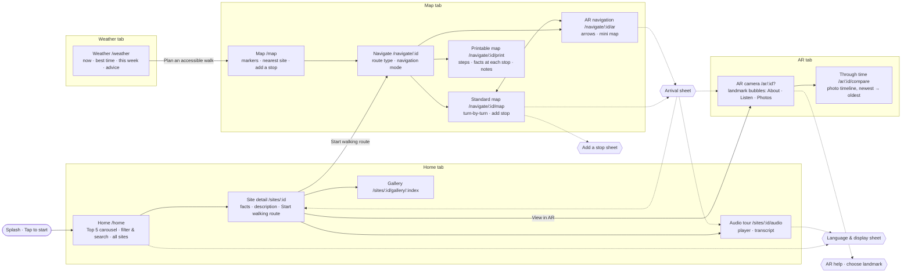

# Site map (complete application)

This is the final information architecture: 13 screens across 4 tabs, plus 5 overlays. It is
generated from the router (`src/router/index.js`), and every node is a real route or overlay.

What changed since the A2 site map:
- **Tabs:** Home, Map, AR and Weather are all top-level tabs, reachable in one tap from every
  screen except full-screen navigation.
- **Screens and overlays:** A3 adds the Splash, the Language & display sheet, the navigation
  mode choice (with route type), the printable map, the arrival sheet and the through-time photo timeline.
- **Offline:** offline is a toggle on the Map, not a page.

## Inventory

| # | Screen / overlay | Route | Tab | Tab bar | Personas |
| --- | --- | --- | --- | --- | --- |
| 1 | Splash | (overlay on launch) | — | hidden | all |
| 2 | Home | `/home` (`/explore` redirects) | Home | ✓ | P1 |
| 3 | Site detail | `/sites/:id` | Home | ✓ | P1 P3 |
| 4 | Gallery | `/sites/:id/gallery/:index?` | Home | ✓ | P3 |
| 5 | Audio tour | `/sites/:id/audio` | Home | ✓ | P1 P2 |
| 6 | Map | `/map` | Map | ✓ | P2 P3 |
| 7 | Navigate: route type & mode | `/navigate/:id` | Map | ✓ | all |
| 8 | Standard map navigation | `/navigate/:id/map` | Map | hidden | P1 P2 |
| 9 | AR navigation | `/navigate/:id/ar` | Map | hidden | P1 |
| 10 | Printable map | `/navigate/:id/print` | Map | ✓ | P2 P3 |
| 11 | AR camera | `/ar/:id?` (no id = nearest) | AR | ✓ | P1 P3 |
| 12 | Through time (photo timeline) | `/ar/:id/compare` (every site) | AR | ✓ | P1 P3 |
| 13 | Weather | `/weather` | Weather | ✓ | all |
| O1 | Language & display | sheet (Home, Audio tour) | — | — | P1 P2 |
| O2 | Add a stop | sheet (Standard map) · inline picker (Map) | — | — | P2 P3 |
| O3 | Arrival | sheet (Standard map, AR navigation) | — | — | P1 P2 |
| O4 | AR help / choose landmark | overlay + sheet (AR camera) | — | — | P1 |
| O5 | Toast | global status message | — | — | all |

**Depth check (NFR5).** Every persona's goal screen is at most three taps from a tab root.
- Audio from Home: Home → Site → Audio.
- Printable map from Map: Map → Nearest → Go → Printable map.

Unknown site IDs and unknown paths redirect to Home.
