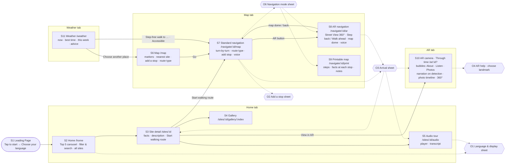

# Site map (complete application)

This is the final information architecture: 11 screens (S1–S11) across 4 tabs, plus 6 overlays
(O1–O6). It is generated from the router (`src/router/index.js`), and every node is a real route
or overlay. Screen numbers follow the app (`SCREENS` in `src/data/designRationale.js`), in the
order a visitor meets them.

What changed since the A2 site map:
- **Tabs:** Home, Map, AR and Weather are all top-level tabs, reachable in one tap from every
  screen except full-screen navigation (S7, S8).
- **Screens and overlays:** A3 adds the S1 Leading Page (Tap to start → Choose your language),
  the Language & display sheet, the printable map, the arrival sheet and the navigation mode
  sheet.
- **Navigation starts on the map:** there is no separate "how would you like to navigate?"
  page. *Go* and *Start walking route* open S7 Standard navigation directly; route type is chosen
  where the routes are drawn (S6, S7), and AR or printable is one tap away in the mode sheet (O6).
- **Through time lives in the AR camera:** once a landmark is detected, S10 plays its photos
  from today to the oldest, with a year slider. S10 and S8 can also show a 360° Google Street View
  panorama (with a Maps key).
- **Offline:** offline is a toggle on the Map, not a page.

```mermaid
flowchart LR
  SPLASH([S1 Leading Page<br/>Tap to start → Choose your language]) --> HOME

  subgraph TAB_HOME [Home tab]
    HOME[S2 Home /home<br/>Top 5 carousel · filter & search · all sites]
    SITE[S3 Site detail /sites/:id<br/>facts · description · Start walking route]
    GALLERY[S4 Gallery /sites/:id/gallery/:index]
    AUDIO[S5 Audio tour /sites/:id/audio<br/>player · transcript]
    HOME --> SITE --> GALLERY
    SITE --> AUDIO
  end

  subgraph TAB_MAP [Map tab]
    MAP[S6 Map /map<br/>markers · nearest site · add a stop · route type]
    NAVMAP[S7 Standard navigation /navigate/:id/map<br/>turn-by-turn · route type · add stop · voice]
    NAVAR[S8 AR navigation /navigate/:id/ar<br/>Street View 360° · Step back / Walk ahead · map dome · voice]
    PRINT[S9 Printable map /navigate/:id/print<br/>steps · facts at each stop · notes]
    MAP -- Go --> NAVMAP
    NAVMAP -- AR button --> NAVAR
    NAVAR -- map dome / back --> NAVMAP
  end

  subgraph TAB_AR [AR tab]
    ARCAM[S10 AR camera · Through time /ar/:id?<br/>bubbles: About · Listen · Photos<br/>narration on detection · photo timeline · 360°]
  end

  subgraph TAB_WEATHER [Weather tab]
    WEATHER[S11 Weather /weather<br/>now · best time · this week · advice]
  end

  SITE -- Start walking route --> NAVMAP
  SITE -- View in AR --> ARCAM
  WEATHER -->|"Step-free walk to … · Accessible"| NAVMAP
  WEATHER -- Choose another place --> MAP

  %% overlays (bottom sheets)
  LANG{{O1 Language & display sheet}}
  STOPS{{O2 Add a stop sheet}}
  ARRIVE{{O3 Arrival sheet}}
  ARHELP{{O4 AR help · choose landmark}}
  MODES{{O6 Navigation mode sheet}}
  HOME -.-> LANG
  AUDIO -.-> LANG
  NAVMAP -.-> STOPS
  NAVMAP -.-> MODES
  MODES -.-> NAVAR
  MODES -.-> PRINT
  NAVMAP -.-> ARRIVE
  NAVAR -.-> ARRIVE
  ARRIVE -.-> AUDIO
  ARRIVE -.-> ARCAM
  ARRIVE -.-> SITE
  ARCAM -.-> ARHELP
```

## Inventory

| # | Screen / overlay | Route | Tab | Tab bar | Personas |
| --- | --- | --- | --- | --- | --- |
| S1 | Leading Page (Tap to start → Choose your language) | (overlay on every launch) | — | hidden | all |
| S2 | Home Page | `/home` (`/`, `/explore` redirect) | Home | ✓ | P1 |
| S3 | Site Detail | `/sites/:id` | Home | ✓ | P1 P3 |
| S4 | Photo Gallery | `/sites/:id/gallery/:index?` | Home | ✓ | P3 |
| S5 | Audio Tour | `/sites/:id/audio` | Home | ✓ | P1 P2 |
| S6 | Map | `/map` | Map | ✓ | P2 P3 |
| S7 | Standard Navigation | `/navigate/:id/map` (`/navigate/:id` redirects) | Map | hidden | all |
| S8 | AR Navigation | `/navigate/:id/ar` | Map | hidden | P1 |
| S9 | Printable Map | `/navigate/:id/print` | Map | ✓ | P2 P3 |
| S10 | AR Camera · Through Time | `/ar/:id?` (no id = nearest; `/ar/:id/compare` redirects) | AR | ✓ | P1 P3 |
| S11 | Weather | `/weather` | Weather | ✓ | all |
| O1 | Language & display | sheet (Home, Audio tour) | — | — | P1 P2 |
| O2 | Add a stop | sheet (Standard navigation) · inline picker (Map) | — | — | P2 P3 |
| O3 | Arrival | sheet (Standard navigation, AR navigation) | — | — | P1 P2 |
| O4 | AR help / choose landmark | overlay + sheet (AR camera) | — | — | P1 |
| O5 | Toast | global status message | — | — | all |
| O6 | Navigation mode | sheet (Standard navigation › Change mode): Standard map / AR navigation / Printable map | — | — | all |

**Depth check (NFR5).** Taps from a tab root to each persona's goal screen:
- Audio from Home (P1, P2): S2 Home → S3 Site → S5 Audio tour (2 taps).
- AR navigation from Home (P1): S2 Home → S3 Site → Start walking route (S7) → AR button (S8)
  (3 taps).
- Printable map from Map (P2, P3): S6 Map → Nearest → Go (S7) → Change mode (O6) → Printable
  map (S9) (4 taps). Moving the mode choice into navigation (so walking starts at once on the
  standard map) costs one extra tap here — the earlier "at most three taps" claim no longer
  holds for this path; flagged for review.
- Accessible walk from Weather (P2): S11 Weather → Step-free walk to … (S7, Accessible route
  selected) (1 tap).

**Redirects and launch.**
- Every launch or refresh shows S1 and then lands on S2 Home, whatever URL was open (Home's
  `?category=&q=` filters are kept).
- Unknown site IDs and unknown paths redirect to Home; `/ar/:id` with an unknown id opens the
  AR camera on the nearest landmark.
- Former pages keep working as redirects: `/navigate/:id` → S7, `/ar/:id/compare` → S10.

**Not a screen.** On a desktop (≥ 960 px with a mouse) a design-notes panel annotates the phone
mock-up with each screen's rationale and RTM trace. It is presentation chrome around the
prototype, not part of the app's information architecture, and never appears on phones.
