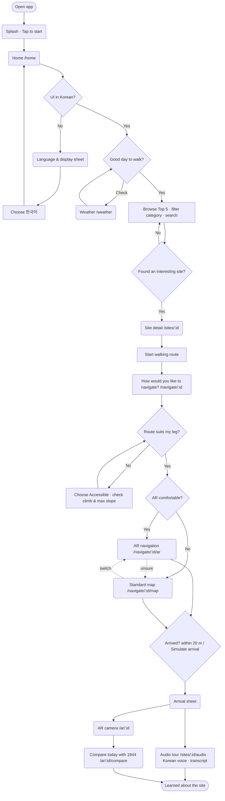
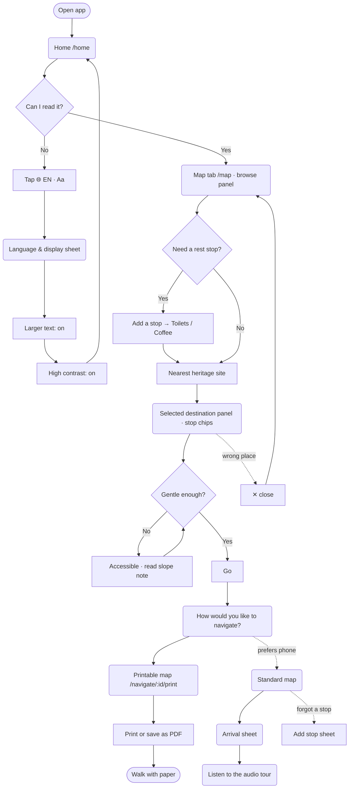
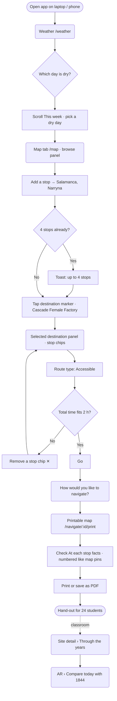

# Task flows (final)

Each flow shows a persona's required workflows on the final prototype.

| Shape | Meaning |
| --- | --- |
| Rounded boxes | Screens (with route) |
| Plain boxes | Actions |
| Diamonds | Decisions |
| Stadiums | Start / end |

Dashed arrows are recovery paths: the "undo / change your mind" routes that Nielsen's
*user control and freedom* heuristic asks for. Every step name matches a real control in the
prototype, so the evaluation task scripts (T1–T9) can follow these flows.

Legend: `W#` = workflow ([personas.md](personas.md)); `FR#`/`NFR#` = requirement ([rtm.md](rtm.md)).

---

## P1 · Minzi: W1 discover → W2 plan → W3 navigate → W4 learn

**Changed in A3 (Round 1).**
- **Route type on the mode screen:** `Choose Accessible` now appears on the mode screen
  (R1-6). Before, a walker who started from a site page never saw the route-type choice.
- **Arrival:** the Arrival sheet (R1-2) replaces the AR-only "arrived" card. Standard map
  users used to have no arrival state at all.

---

## P2 · Margaret: W5 reading comfort → W6 gentle walk → W7 paper map (+ W4)

**Changed in A3 (Round 1).** The display settings (R1-1) are a new branch; before A3 there was
no way to change text size or contrast. Task T5 measures whether the "Aa" cue is found
without help.

**Open question (H5).** Stops are added from the browse panel *before* choosing a destination,
or from **Add stop** during navigation. The selected-destination panel, where the route time
is shown, can only *remove* stops. T6 and T8 observe whether people look for "add" there.

---

## P3 · Sam: W8 forecast → W9 multi-stop route → W10 hand-out (→ W11)

**Changed in A3 (Round 1).** The printed page now carries per-stop facts (R1-4), which makes it
usable as a class hand-out without extra research.
