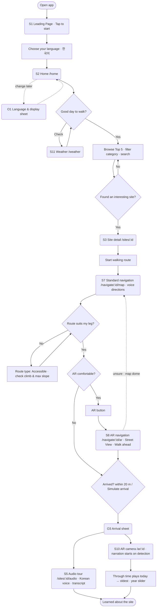
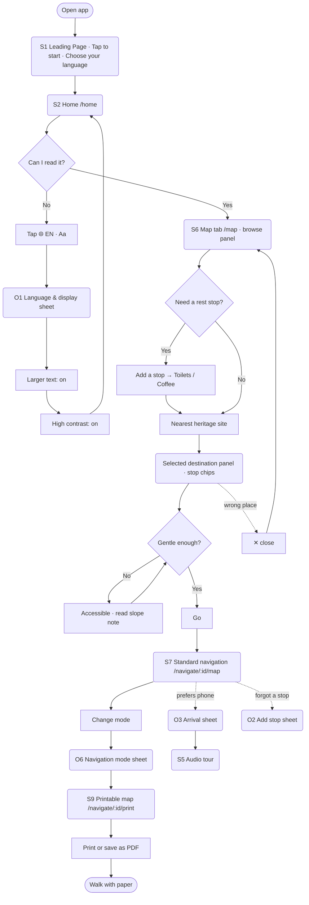
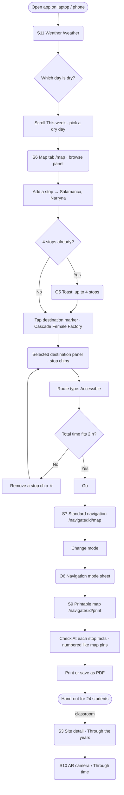

# Task flows (final)

Each flow shows a persona's required workflows on the final prototype.

| Shape | Meaning |
| --- | --- |
| Rounded boxes | Screens (screen number S# as in the [site map](site-map.md), with route) |
| Plain boxes | Actions |
| Diamonds | Decisions |
| Stadiums | Start / end |

Dashed arrows are recovery paths: the "undo / change your mind" routes that Nielsen's
*user control and freedom* heuristic asks for. Every step name matches a real control in the
prototype, so the evaluation task scripts (T1–T9) can follow these flows.

Legend: `S#` / `O#` = screen / overlay ([site-map.md](site-map.md)); `W#` = workflow
([personas.md](personas.md)); `FR#`/`NFR#` = requirement ([rtm.md](rtm.md)).

---

## P1 · Minzi: W1 discover → W2 plan → W3 navigate → W4 learn

```mermaid
flowchart TD
  S([Open app]) --> SP(S1 Leading Page · Tap to start) --> LG[Choose your language · 한국어] --> H(S2 Home /home)
  H -. change later .-> LS(O1 Language & display sheet) -.-> H
  H --> W{Good day to walk?}
  W -- Check --> WE(S11 Weather /weather) --> W
  W -- Yes --> B[Browse Top 5 · filter category · search]
  B --> F{Found an interesting site?}
  F -- No --> B
  F -- Yes --> SD(S3 Site detail /sites/:id)
  SD --> ST[Start walking route]
  ST --> MAP(S7 Standard navigation /navigate/:id/map · voice directions)
  MAP --> RT{Route suits my leg?}
  RT -- No --> ACC[Route type: Accessible · check climb & max slope] --> RT
  RT -- Yes --> MO{AR comfortable?}
  MO -- Yes --> ARB[AR button] --> AR(S8 AR navigation /navigate/:id/ar · Street View · Walk ahead)
  MO -- No --> ARR
  AR -. unsure · map dome .-> MAP
  AR --> ARR{Arrived? within 20 m / Simulate arrival}
  ARR --> AS(O3 Arrival sheet)
  AS --> AU(S5 Audio tour /sites/:id/audio · Korean voice · transcript)
  AS --> SC(S10 AR camera /ar/:id · narration starts on detection) --> CP[Through time plays today → oldest · year slider]
  AU --> E([Learned about the site])
  CP --> E
```

**Changed in A3.**
- **Language first:** the Leading Page (S1) asks for a language straight after *Tap to start*,
  so Minzi reaches Home already in Korean; the Language & display sheet (O1) stays available
  for changing it later.
- **Route type in navigation (Round 1 R1-6, then simplified):** `Accessible` was first added to
  a separate "How would you like to navigate?" page, because a walker who started from a site
  page never saw the route-type choice. That page has since been removed: *Start walking route*
  opens S7 directly and the route-type picker sits in its summary, so walking starts one step
  sooner and the choice is made where the routes are drawn.
- **Arrival:** the Arrival sheet (R1-2) replaces the AR-only "arrived" card. Standard map
  users used to have no arrival state at all.
- **Through time in the camera:** the separate compare page is gone; S10 plays the site's photos
  from today back to the oldest once the landmark is detected.

---

## P2 · Margaret: W5 reading comfort → W6 gentle walk → W7 paper map (+ W4)

```mermaid
flowchart TD
  S([Open app]) --> SP(S1 Leading Page · Tap to start · Choose your language) --> H(S2 Home /home)
  H --> R{Can I read it?}
  R -- No --> AA[Tap 🌐 EN · Aa] --> DS(O1 Language & display sheet)
  DS --> LT[Larger text: on] --> HC[High contrast: on] --> H
  R -- Yes --> M(S6 Map tab /map · browse panel)
  M --> ST{Need a rest stop?}
  ST -- Yes --> ADD[Add a stop → Toilets / Coffee] --> N
  ST -- No --> N[Nearest heritage site]
  N --> SEL(Selected destination panel · stop chips)
  SEL --> RT{Gentle enough?}
  RT -- No --> ACC[Accessible · read slope note] --> RT
  RT -- Yes --> GO[Go]
  GO --> MAP(S7 Standard navigation /navigate/:id/map)
  MAP --> CM[Change mode] --> NM(O6 Navigation mode sheet)
  NM --> PR(S9 Printable map /navigate/:id/print)
  PR --> P[Print or save as PDF] --> WALK([Walk with paper])
  MAP -. prefers phone .-> AS(O3 Arrival sheet) --> AU(S5 Audio tour)
  MAP -. forgot a stop .-> WS(O2 Add stop sheet)
  SEL -. wrong place .-> X[✕ close] --> M
```

**Changed in A3 (Round 1).** The display settings (R1-1) are a new branch; before A3 there was
no way to change text size or contrast. Task T5 measures whether the "Aa" cue is found
without help. Since the mode page was removed, the printable map is reached from standard
navigation through *Change mode* (O6).

**Open question (H5).** Stops are added from the browse panel *before* choosing a destination,
or from **Add stop** during navigation. The selected-destination panel, where the route time
is shown, can only *remove* stops. T6 and T8 observe whether people look for "add" there.

---

## P3 · Sam: W8 forecast → W9 multi-stop route → W10 hand-out (→ W11)

```mermaid
flowchart TD
  S([Open app on laptop / phone]) --> WE(S11 Weather /weather)
  WE --> D{Which day is dry?}
  D --> WK[Scroll This week · pick a dry day]
  WK --> M(S6 Map tab /map · browse panel)
  M --> ADD[Add a stop → Salamanca, Narryna]
  ADD --> FULL{4 stops already?}
  FULL -- Yes --> TOAST(O5 Toast: up to 4 stops) --> PK
  FULL -- No --> PK[Tap destination marker · Cascade Female Factory]
  PK --> SEL(Selected destination panel · stop chips)
  SEL --> ACC[Route type: Accessible]
  ACC --> T{Total time fits 2 h?}
  T -- No --> RM[Remove a stop chip ✕] --> SEL
  T -- Yes --> GO[Go] --> MAP(S7 Standard navigation /navigate/:id/map)
  MAP --> CM[Change mode] --> NM(O6 Navigation mode sheet)
  NM --> PR(S9 Printable map /navigate/:id/print)
  PR --> FACTS[Check At each stop facts · numbered like map pins]
  FACTS --> P[Print or save as PDF] --> E([Hand-out for 24 students])
  E -. classroom .-> SD(S3 Site detail › Through the years) --> CP(S10 AR camera › Through time)
```

**Changed in A3 (Round 1).** The printed page now carries per-stop facts (R1-4), which makes it
usable as a class hand-out without extra research.
