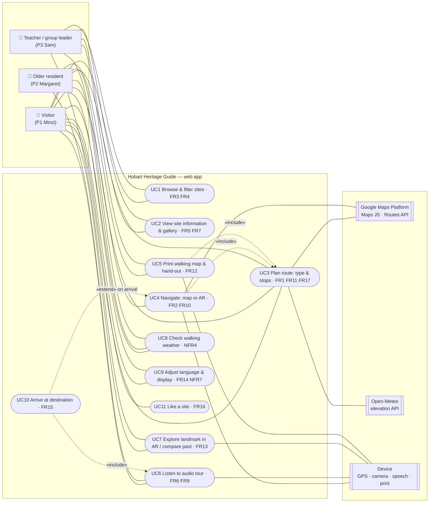
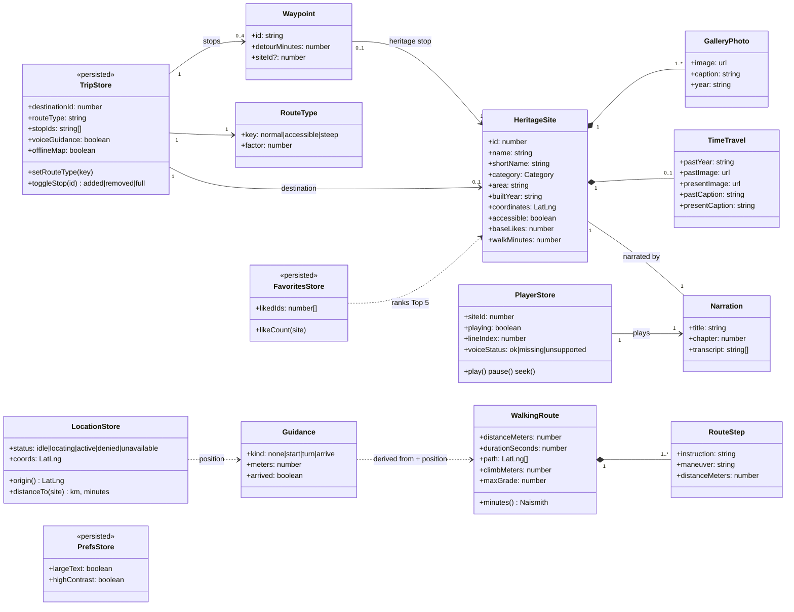
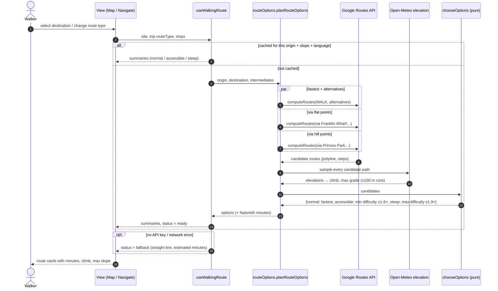
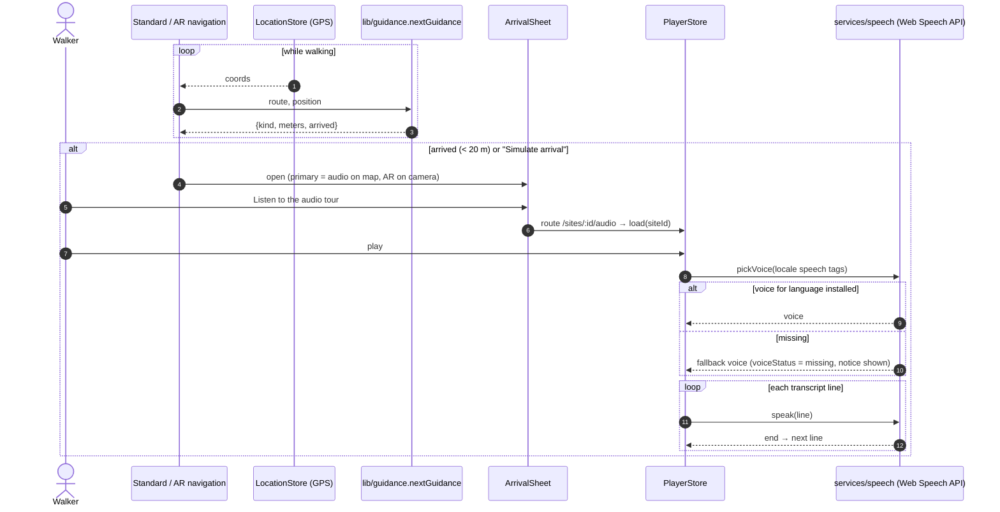
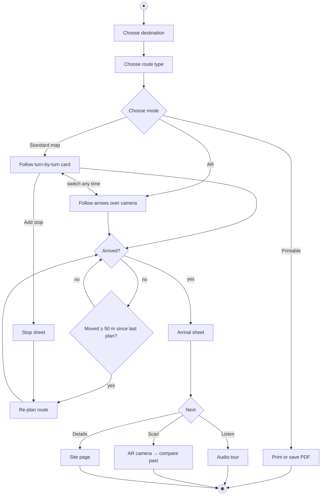
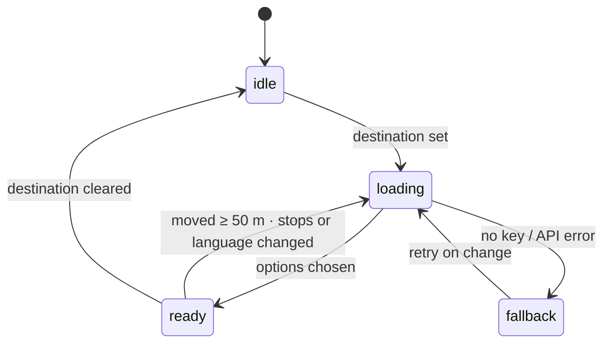
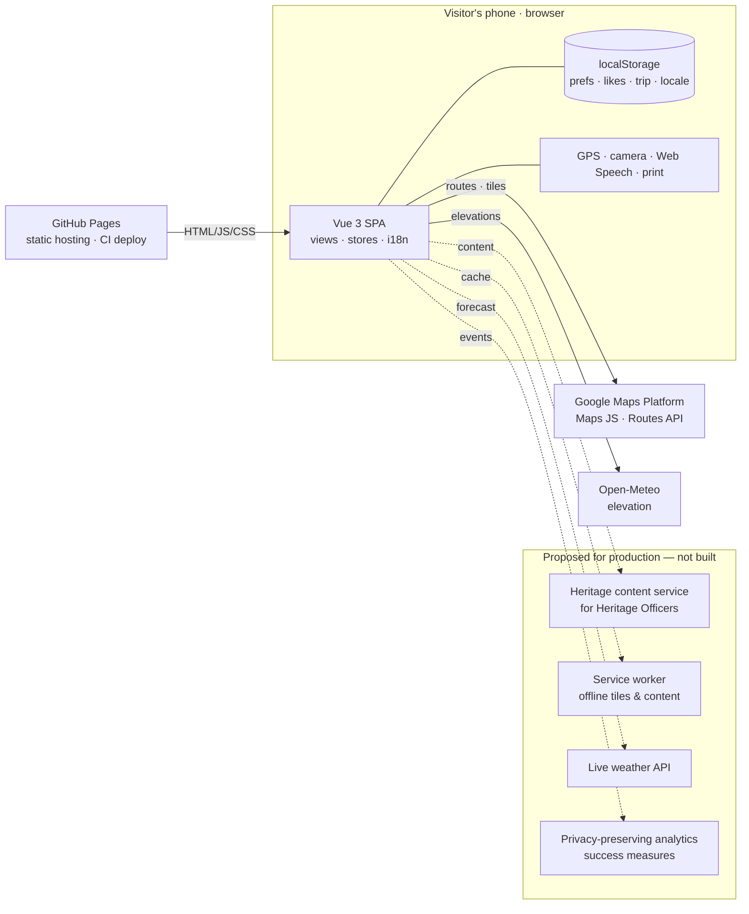

# UML artefacts (final)

All diagrams are drawn from the final code, not from intent. That matters for consistency: the
A2 sequence diagrams showed an AWS cloud service and a database, which the prototype never had.
The A3 set therefore separates:

- **§1–§6 Prototype as built:** a static single-page app on GitHub Pages. User state lives in
  the browser (localStorage), and the only servers are Google Maps Platform and Open-Meteo.
- **§7 Proposed production architecture:** what the City of Hobart would add (a content
  service for Heritage Officers, offline caching, analytics). This is labelled as a
  recommendation.

Requirement IDs → [rtm.md](rtm.md). Rendered SVG/PNG copies → [figures/](figures/).

---

## 1. Use case diagram

Actors are the three personas (primary), plus external systems (secondary). The system
boundary is the web app. Use case IDs map to requirements.



---

## 2. Domain class diagram

Static data (`src/data`), Pinia stores (user state, persisted where marked «persisted») and the
route model produced by the services.



---

## 3. Sequence diagram: planning the three route options (FR1, NFR3)

`useWalkingRoute` is used by the Map, Navigate, Standard, AR and Print screens. Results are
cached per origin, destination, stops and language, and re-planned only after 50 m of movement.



---

## 4. Sequence diagram: arrival → audio tour (FR15, FR6, FR9)



---

## 5. Activity diagram: navigation with mode switching and arrival (W3, W4)



---

## 6. State machines

**Audio player** (`stores/player.js`)

```mermaid
stateDiagram-v2
  [*] --> Idle
  Idle --> Playing: play
  Playing --> Paused: pause (resumes from line start)
  Paused --> Playing: play
  Playing --> Playing: seek (snaps to line start) / next line
  Playing --> Ended: last line finished
  Ended --> Playing: play (restart)
  Idle --> Idle: locale change → reset
  Paused --> Idle: load another site
  note right of Playing: no speech API → same clock runs silently\nvoiceStatus: ok | missing | unsupported
```

**Walking route** (`useWalkingRoute` status)



---

## 7. Deployment: prototype vs proposed production



- **Why no backend in the prototype:** the case constraints (limited budget, variable
  connectivity) and the Agile MVP scope favoured a static SPA with free browser APIs
  (Web Speech, Geolocation).
- **Production additions:** the dashed services are the recommended next increments.
  - The content service lets Heritage Officers keep information accurate (a case constraint).
  - The service worker makes NFR2 real.
  - Analytics measure the client's success criteria (participation, engagement).
