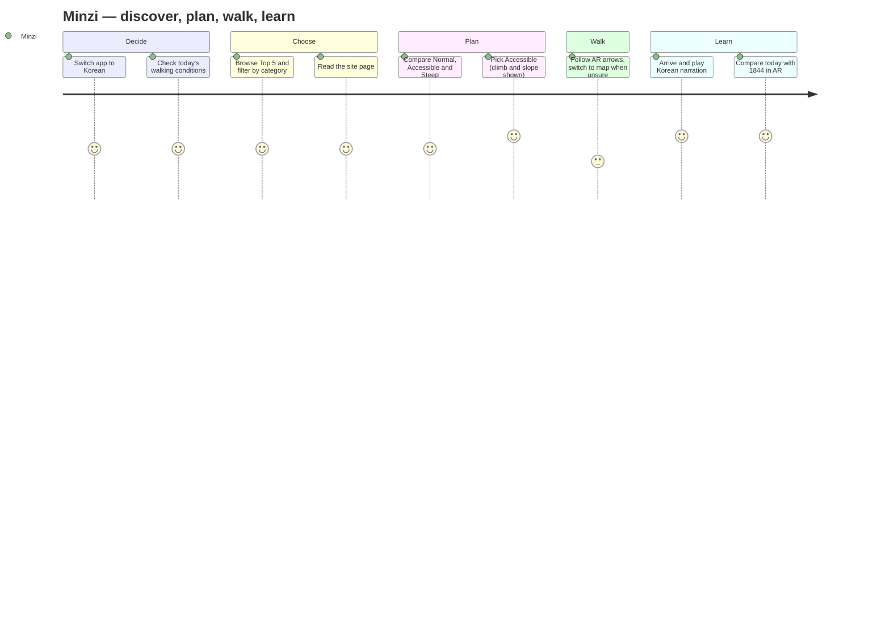
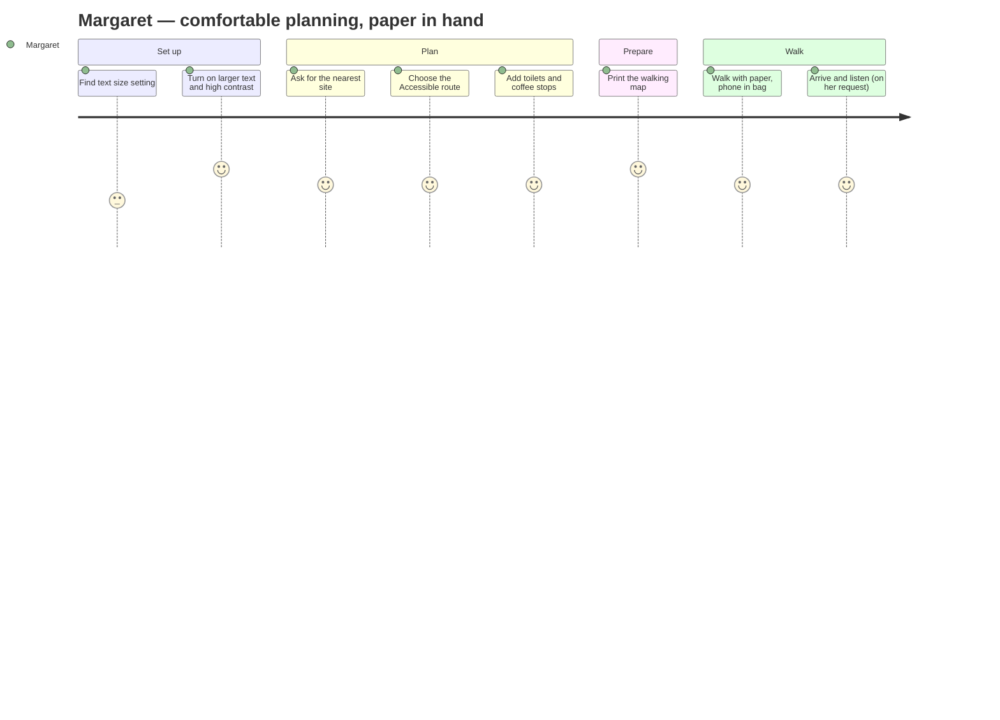
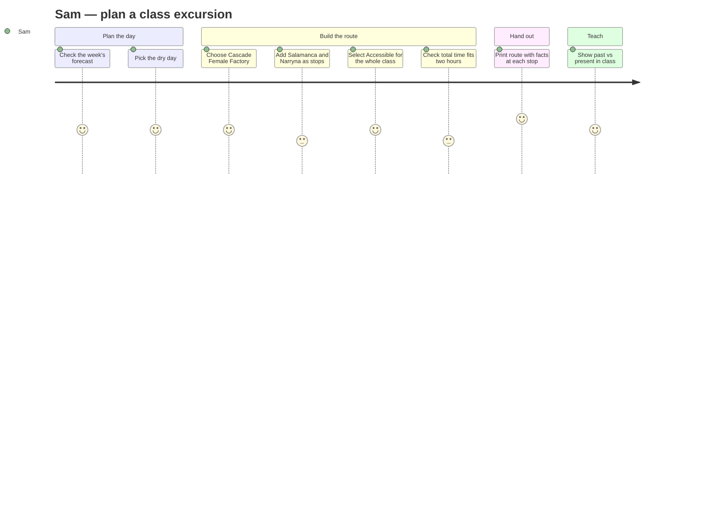

# User journeys (final, "to-be")

Each journey follows one persona through the final prototype.
- **Design response:** the feature (and requirement) that answers each pain point.
- **Satisfaction scores:** these (1–5, in the Mermaid diagrams) are the design team's
  *expected* experience. The evaluation (tasks T1–T9) tests them, and
  [findings.md](evaluation/findings.md) records where reality differed.

Persona and workflow IDs → [personas.md](personas.md). Requirement IDs → [rtm.md](rtm.md).

---

## P1 · Minzi: "Find a flat route and hear the story in Korean"

| Stage | Doing | Thinking / feeling | Pain point (before) | Design response (requirement) |
| --- | --- | --- | --- | --- |
| Decide | Opens the app and switches to 한국어 | "Will this be in my language?" · hopeful | English-only information | 5-language UI, content and narration (FR9, NFR7) |
| Choose | Top 5 carousel, category chips, search | "Which one is worth it for my studies?" · curious | Information scattered across sources | Curated Top 5, category filter and search (FR3, FR4) |
| Plan | Opens Map, selects a site, compares route types | "Can my leg handle this?" · worried | Steepness invisible on normal maps | Normal/Accessible/Steep with real climb and max slope (FR1, NFR1) |
| Walk | AR arrows; taps **Map** when unsure | "Am I going the right way?" · unsure → reassured | Fear of getting lost; AR unfamiliar | AR HUD plus one-tap switch to the standard map (FR2, FR10) |
| Learn | Arrival sheet → **Listen to the audio tour**; AR → Compare | "I want to understand this place" · engaged | Text-heavy signage | Arrival sheet, Korean narration with transcript, past/present compare (FR6, FR7, FR13) |

**Moments that matter:** choosing the route type (where anxiety is highest) and arrival (where
the payoff comes).

---

## P2 · Margaret: "Big text, gentle streets, somewhere to sit"

| Stage | Doing | Thinking / feeling | Pain point (before) | Design response (requirement) |
| --- | --- | --- | --- | --- |
| Set up | Taps "🌐 EN · Aa" → Language & display → Larger text, High contrast | "I can't read this grey writing" · frustrated → relieved | Small, low-contrast text; the setting was never built (A1 NFR1) | Display switches, persisted; outlines ≥ 3:1 (NFR1, **Round 1 R1-1**) |
| Plan | Map → Nearest heritage site → Accessible | "Not up those hills again" · cautious | Route difficulty unknown | Accessible route with climb and slope; the note warns about steps (FR1, NFR1) |
| Plan | Add a stop → Toilets, Coffee | "Where can I rest?" · reassured | No rest information | Amenity stops, up to 4 (FR11) |
| Prepare | Go → Printable map → Print | "I like having it on paper" · confident | Battery and screen glare outdoors | Printable map with steps and notes (FR12, NFR2) |
| Arrive | Arrival sheet → Listen to the audio tour | "Only when I ask for it" · in control | Apps that talk unprompted | Audio is one tap away, never autoplays (FR6, WCAG 1.4.2) |

**Moment that matters:** finding the text-size setting. If she can't find it, nothing else is
readable. Task T5 tests its discoverability directly.

---

## P3 · Sam: "One accessible route, printed for 24 students"

| Stage | Doing | Thinking / feeling | Pain point (before) | Design response (requirement) |
| --- | --- | --- | --- | --- |
| Plan the day | Weather → This week | "Which day stays dry?" · planning | Weather checked in a separate app | Weekly forecast inside the guide (NFR4) |
| Build the route | Map → Add a stop ×2 → destination → Accessible | "Can the wheelchair user come on every leg?" · responsible | No accessibility data for risk assessment | Heritage stops routed as real waypoints, Accessible route, slope note (FR1, FR11, NFR1) |
| Check fit | Reads the total minutes | "Does this fit the timetable?" · uncertain | Times differ between screens (a hypothesis to test, H1) | Route summary time; estimate consistency tested in T8 |
| Hand out | Printable map → At each stop → Print or save as PDF | "Every student gets the same sheet" · satisfied | Students' phone use is restricted | Per-stop facts, numbered like the map pins, plus notes space (FR12, **Round 1 R1-4**) |
| Teach | Site → Through the years; AR → Compare | "Show them what it looked like" · engaged | Archives hard to find | Gallery and time-travel compare (FR7, FR13) |

**Moment that matters:** confirming the route really is accessible and fits the time. That
is where trust in the tool is won or lost.
